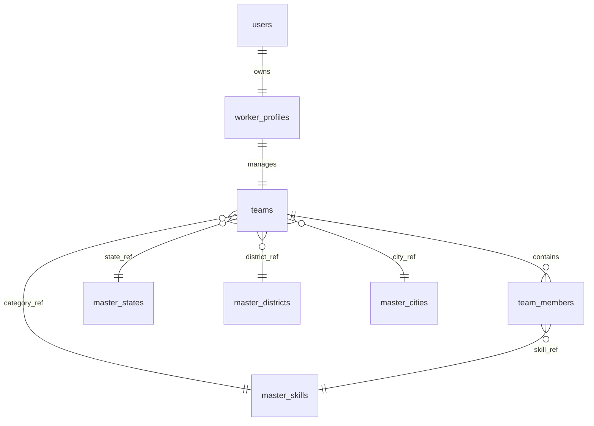

# STEP B2.4.2 — NEWTRON WORKFORCE PRODUCTION TEAM DATA MODEL & API CONTRACT DESIGN

## 1. Executive Summary
This document specifies the database schema, relational cardinality rules, API input/output contracts, and validation specifications for the **Team Registration** (B2) module in the Newtron Workforce backend. It serves as a blueprint for implementing backend persistence (B2.5) without guessing or changing the frontend UI flow.

## 2. Final Domain Model & Cardinality
We define the business relationships between authenticated entities, teams, and members:
- **User ↔ WorkerProfile**: One-to-one mapping (already exists).
- **WorkerProfile ↔ Team**: One-to-one mapping. One worker profile can own at most **one** active team. A team cannot exist without a valid owner (`WorkerProfile`).
- **Team ↔ TeamMember**: One-to-many relationship. A team can have multiple team members.
- **Team Members**: Flat entities, separate from the Team Owner (no user accounts are generated for members).
- **Rules**:
  1. **Can one WorkerProfile own multiple Teams?** **NO**. Only one active team is permitted.
  2. **Can a Team exist without an owner?** **NO**. `owner_worker_profile_id` is a required, non-nullable foreign key referencing `worker_profiles(id)`.
  3. **Can one mobile number appear twice inside the same Team?** **NO** (enforced by a composite unique index on team member mobile numbers).
  4. **Can one mobile number appear in multiple Teams?** **YES** (allows workers to belong to multiple external teams over time).
  5. **Can a Team have zero additional members?** **NO** (validation requires at least one member separate from the owner).

## 3. Relationship Diagram


## 4. Final Database Table Design
Consistent with the existing database conventions, we propose the following schema.

### A. Table: `teams`
| Column Name | SQL Type | Nullable | Default | Purpose / Description |
| :--- | :--- | :---: | :--- | :--- |
| `id` | `BIGINT` | NO | Auto-Increment | Primary Key |
| `uuid` | `VARCHAR(36)` | NO | UUID String | Globally unique identifier (API resource boundary) |
| `owner_worker_profile_id` | `BIGINT` | NO | | Foreign Key -> `worker_profiles(id)`. Unique constraint. |
| `team_name` | `VARCHAR(100)` | NO | | Registered Name |
| `primary_skill_id` | `BIGINT` | NO | | Foreign Key -> `master_skills(id)`. Maps Team Primary Category. |
| `about_team` | `TEXT` | YES | | Optional description text |
| `state_id` | `BIGINT` | NO | | Foreign Key -> `master_states(id)` |
| `district_id` | `BIGINT` | NO | | Foreign Key -> `master_districts(id)` |
| `city_id` | `BIGINT` | NO | | Foreign Key -> `master_cities(id)` |
| `work_area_address` | `VARCHAR(255)` | NO | | Local area street address |
| `created_at` | `TIMESTAMP` | NO | `CURRENT_TIMESTAMP` | Audit log |
| `updated_at` | `TIMESTAMP` | NO | `CURRENT_TIMESTAMP` | Audit log |
| `created_by` | `VARCHAR(100)` | YES | | Audit log |
| `updated_by` | `VARCHAR(100)` | YES | | Audit log |
| `version` | `BIGINT` | NO | `0` | Optimistic locking |
| `deleted` | `BOOLEAN` | NO | `FALSE` | Soft-delete flag |

### B. Table: `team_members`
| Column Name | SQL Type | Nullable | Default | Purpose / Description |
| :--- | :--- | :---: | :--- | :--- |
| `id` | `BIGINT` | NO | Auto-Increment | Primary Key |
| `team_id` | `BIGINT` | NO | | Foreign Key -> `teams(id)` |
| `full_name` | `VARCHAR(100)` | NO | | Member name |
| `mobile_number` | `VARCHAR(15)` | NO | | Indian mobile number |
| `primary_skill_id` | `BIGINT` | NO | | Foreign Key -> `master_skills(id)`. Maps Member Role. |
| `experience` | `VARCHAR(50)` | YES | | Experience details (e.g., "5 years") |
| `created_at` | `TIMESTAMP` | NO | `CURRENT_TIMESTAMP` | Audit log |
| `updated_at` | `TIMESTAMP` | NO | `CURRENT_TIMESTAMP` | Audit log |
| `created_by` | `VARCHAR(100)` | YES | | Audit log |
| `updated_by` | `VARCHAR(100)` | YES | | Audit log |
| `version` | `BIGINT` | NO | `0` | Optimistic locking |
| `deleted` | `BOOLEAN` | NO | `FALSE` | Soft-delete flag |

### Keys, Constraints & Indexes
1. **`teams` table**:
   - `CONSTRAINT fk_teams_owner FOREIGN KEY (owner_worker_profile_id) REFERENCES worker_profiles(id)`
   - `CONSTRAINT uq_teams_owner UNIQUE (owner_worker_profile_id, deleted)` (forces one active team per worker, allowing re-creation if previous team is soft-deleted)
   - `CONSTRAINT fk_teams_state FOREIGN KEY (state_id) REFERENCES master_states(id)`
   - `CONSTRAINT fk_teams_district FOREIGN KEY (district_id) REFERENCES master_districts(id)`
   - `CONSTRAINT fk_teams_city FOREIGN KEY (city_id) REFERENCES master_cities(id)`
   - `CONSTRAINT fk_teams_skill FOREIGN KEY (primary_skill_id) REFERENCES master_skills(id)`
   - `INDEX idx_teams_uuid (uuid)`
2. **`team_members` table**:
   - `CONSTRAINT fk_members_team FOREIGN KEY (team_id) REFERENCES teams(id)`
   - `CONSTRAINT fk_members_skill FOREIGN KEY (primary_skill_id) REFERENCES master_skills(id)`
   - `CONSTRAINT uq_team_members_mobile UNIQUE (team_id, mobile_number, deleted)` (prevents adding the same mobile number twice within the same team)

## 5. Skill / Category Decision
- **Recommendation**: **ID-Only Mapping**.
  - The database stores `primary_skill_id` pointing to `master_skills(id)`.
  - The API payload must send the actual `primarySkillId` (`Long`) retrieved by the frontend from the master skills API. The backend **will not** perform any hybrid text-to-ID mapping.
  - If a sent skill ID does not exist in `master_skills`, a `ValidationException(INVALID_SKILL)` is thrown.

## 6. Location Data Contract
- **Decision**: The frontend must send `stateId`, `districtId`, and `cityId` as `Long` ID values strictly matching the location master tables.
- **Ambiguity Resolution**: The frontend `City / District` input must select from the backend city master and map to the corresponding `districtId` and `cityId` before transmission.

## 7. Team Member Data & Validation Rules
- `fullName`: Required, `VARCHAR(100)`, cannot be blank.
- `mobileNumber`: Required, must be a 10-digit number. Enforces duplicate checks preventing:
  - The same mobile number twice in the same team.
  - Adding the Team Owner's mobile number as a member.
- `primarySkillId`: Required, must reference a valid `master_skills(id)`.
- `experience`: Optional, maximum length 50 characters.

## 8. Team Registration API Contract
We define a single atomic endpoint for Team Registration.

- **HTTP Method**: `POST`
- **Endpoint**: `/api/v1/worker/teams`
- **Authentication**: Required (JWT Bearer Token).
- **Role Requirement**: `ROLE_WORKER`.
- **Request Body (JSON)**:
```json
{
  "teamName": "Super Masons",
  "primarySkillId": 6,
  "aboutTeam": "Professional residential construction crew",
  "stateId": 1,
  "districtId": 12,
  "cityId": 145,
  "workAreaAddress": "Lane 4, Sector 7, Noida",
  "members": [
    {
      "fullName": "Amit Kumar",
      "mobileNumber": "9876543210",
      "primarySkillId": 6,
      "experience": "5 years"
    },
    {
      "fullName": "Rajesh Singh",
      "mobileNumber": "8765432109",
      "primarySkillId": 2,
      "experience": "3 years"
    }
  ]
}
```
- **Response Body (JSON - Success)**:
```json
{
  "success": true,
  "message": "Team registered successfully",
  "data": {
    "teamId": 23,
    "uuid": "4a5c9b83-cf2d-4874-8b64-07d0f91a58c1",
    "teamName": "Super Masons",
    "ownerName": "Lead Owner",
    "memberCount": 2
  },
  "meta": {
    "apiVersion": "v1.0",
    "timestamp": "2026-08-22T00:50:00Z",
    "requestId": "a0f5e1c3-48b2-4cd8-b391-72f88a91c3d9",
    "path": "/api/v1/worker/teams",
    "processingTimeMs": 24
  }
}
```

## 9. Atomic Transaction Design
The registration must run inside a single transaction. If validating state, city, primary skill, or member mobile numbers fails, the transaction rolls back, and nothing is persisted.
- **Service Annotation**: `@Transactional(rollbackFor = Exception.class)` applied to the team service registration method.

## 10. Ownership & Security Design
- **Authentication**: The Team Owner is resolved dynamically from Spring Security's `SecurityContext`. Manually passing an owner ID in the payload is ignored.
- **Verification Hook**:
```java
User currentUser = fetchCurrentUser(userDetails);
WorkerProfile ownerProfile = workerProfileRepository.findByUser(currentUser)
    .orElseThrow(() -> new ResourceNotFoundException("WORKER_PROFILE_NOT_FOUND", "Worker profile setup required first"));
```
- Future endpoints (`PUT /api/v1/worker/teams/me`) will fetch the team associated with the authenticated user's `WorkerProfile.id` to ensure workers cannot modify other teams.

## 11. Work Mode VS Team Persistence
- **Onboarding Status Update**: **NONE**.
  - During B2.5, only the `Team` and `TeamMember` entities will be persisted.
  - The workMode selection remains temporary on the frontend client side via `work_mode_<userId>`.
  - No database schema column updates or automatic user onboarding status state transitions will be triggered on the backend. This will be separately addressed when a global backend onboarding flow is designed.

## 12. Future Read & Update API Contracts
### Get My Team
- **Endpoint**: `GET /api/v1/worker/teams/me`
- **Response Data Shape**:
```json
{
  "teamName": "Super Masons",
  "primarySkill": "Mason",
  "aboutTeam": "Professional residential construction crew",
  "state": "Uttar Pradesh",
  "city": "Noida",
  "members": [
    {
      "fullName": "Amit Kumar",
      "mobileNumber": "9876543210",
      "role": "Mason",
      "experience": "5 years"
    }
  ]
}
```

### Team Updates
- `PUT /api/v1/worker/teams/me`: Update details (Team name, Address).
- `POST /api/v1/worker/teams/me/members`: Add a member.
- `PUT /api/v1/worker/teams/me/members/{id}`: Edit member.
- `DELETE /api/v1/worker/teams/me/members/{id}`: Remove member.

## 13. Error Contract
| Scenario | Error Code | HTTP Status |
| :--- | :--- | :---: |
| Not Authenticated | `NOT_AUTHENTICATED` | 401 |
| Not WORKER Role | `FORBIDDEN` | 403 |
| Owner Profile missing | `WORKER_PROFILE_NOT_FOUND` | 404 |
| Owner already has Team | `TEAM_ALREADY_EXISTS` | 409 |
| Duplicate mobile in Team | `DUPLICATE_TEAM_MEMBER` | 409 |
| Owner mobile added as member | `INVALID_MEMBER_MOBILE` | 422 |
| Invalid state/city/skill ID | `INVALID_REFERENCE_ID` | 422 |

## 14. Required Frontend Changes
1. **Dropdown Selector Mapping**: Update B2.1 and B2.2 text input forms to drop-down elements querying master states, cities, and skills, returning the corresponding database ID rather than raw text.
2. **Atomic Submit integration**: Update the Submit handler in B2.3 to make a single POST request containing the team details and member list payloads.

## 15. Implementation Sequence (B2.5 onwards)
1. **B2.5.1 — Flyway Migration**: Write `V23__create_team_tables.sql`. Verify the database engine constraints to ensure unique indexes correctly ignore soft-deleted flags.
2. **B2.5.2 — JPA Entities**: Implement `Team` and `TeamMember` classes inheriting from `BaseEntity`.
3. **B2.5.3 — JPA Repositories**: Create `TeamRepository` and `TeamMemberRepository`.
4. **B2.5.4 — DTOs**: Create requests, responses, and validation classes.
5. **B2.5.5 — Service & Transaction Implementation**: Create `TeamService` and `TeamServiceImpl` with `@Transactional` registration logic.
6. **B2.5.6 — Controller**: Add `WorkerTeamController` mapping `/api/v1/worker/teams`.
7. **B2.5.7 — Integration Tests**: Verify constraints and edge cases.
8. **B2.5.8 — Frontend API Integration**: Connect Flutter screens to the new POST endpoint.

## 16. Risks / Open Decisions
- **None**. The database structure and API contracts map cleanly to the existing codebase patterns.

## 17. Exact Files Inspected
- [V1__create_users_table.sql](file:///d:/NewtronProjects/newtron-workforce-backend/newtron-workforce-backend/src/main/resources/db/migration/V1__create_users_table.sql)
- [V7__create_worker_profiles_table.sql](file:///d:/NewtronProjects/newtron-workforce-backend/newtron-workforce-backend/src/main/resources/db/migration/V7__create_worker_profiles_table.sql)
- [User.java](file:///d:/NewtronProjects/newtron-workforce-backend/newtron-workforce-backend/src/main/java/com/newtron/newtron_workforce_backend/auth/entity/User.java)
- [WorkerProfile.java](file:///d:/NewtronProjects/newtron-workforce-backend/newtron-workforce-backend/src/main/java/com/newtron/newtron_workforce_backend/entity/WorkerProfile.java)
- [BaseEntity.java](file:///d:/NewtronProjects/newtron-workforce-backend/newtron-workforce-backend/src/main/java/com/newtron/newtron_workforce_backend/common/entity/BaseEntity.java)

## 18. Exact Files Modified
- **NONE** (Only the design markdown document has been written to the workspace docs).

---

**Ready for implementation**: **YES**
